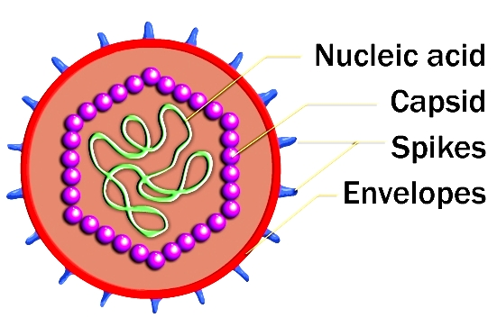

### Principle:
 
#### General Properties of Virus:
 

Viruses do not fall in the category of unicellular microorganism. They lack cellular organizations and contain only one type nucleic acids, either DNA or RNA.Viruses are obligate intracellular parasites and lack the enzyme necessary for protein and nucleic acid synthesis. They depend on the host machinery for their growth and survival. Unlike other microorganism, complex processes are involved in their multiplication. Outside of the host cells, viruses are inactive. However, inside living cells, viruses show some of the characteristics of living things. Viruses are of medical importance because they have the ability to cause a very large number of human diseases. Virus diseases range from the minor common cold to sporadic and endemic diseases such as mumps, hepatitis and so on.

The extracellular infectious virus particle is called “virion”. Unlike bacteria, viruses are much smaller and are too small to be seen the light microscope, so they were called as “ultramicroscopic”. The size of the virus varies widely; the largest virus is pox virus (300 nm) and the smallest is parvovirus (20 nm).The size of the virus can be measured directly with the aid of electron microscopy. The virion consists of a nucleic acid surrounded by a protein coat, the capsid. Capsid introduces the viral genome into host cells by adsorbing to cell surfaces of the host. A capsid is made up of protein subunits called capsomers. Capsomers determine antigenicity of the virion. The capsid with the enclosed nucleic acid is called as nucleocapsid. The nucleocapsid protects the nucleic acid from the action of any chemical and environmental agents. The virion may be enveloped or naked (nonenveloped).The envelope is the outer covering of the virus; lipoproteinaceous in nature and is derived from the host cell membrane during the release of the progeny virus by budding. The envelope may be covered by spikes, which are made up of carbohydrate and protein complexes and project out into space from the surfaces of the envelope used for attachment to host cells. Envelopes provide chemical, antigenic and biological properties on virus(Fig 1).

 Figure 1: Structure of Virus
 
Most viruses are very heat labile. Viruses are stable at low temperatures. The virus suspension can be stored for long term at -700oC. Lyophilisation or freeze drying is the better method for prolonged storage of virus suspension. Sunlight, UV rays and ionizing radiation can inactivate viruses. Alkaline conditions disrupt all the viruses. Antibacterial agents are completely ineffective against viruses.

The shape of the virus particles varies in different groups of viruses is shown below (Fig 2).

### Methods for Cultivation of Virus:

Since the viruses are obligate intracellular parasites, they cannot be grown on any inanimate culture medium. Viruses can be cultivated within suitable hosts, such as a living cell. Generally three methods are employed for the virus cultivation.

1.    Inoculation of virus into animals.

2.    Inoculation of virus into embryonated eggs.

3.    Tissue culture.

#### Inoculation of Virus in Animals

Laboratory animals are widely used for routine cultivation of virus; they play an essential role in studies of viral pathogenesis. Live animals such as monkeys, mice, rabbits, guinea pigs, ferrets are widely used for cultivating virus. Monkeys were used for the isolation of Poliovirus. But due to their risk to handlers, monkeys find only limited applications in Virology. Mice are the most widely employed animals in virology. The different routes of inoculation in mice are intracerebral, subcutaneous, intraperitoneal or intranasal. After the animal is inoculated with the virus suspension, the animal is observed for signs of disease, visible lesions or is killed so that infected tissues can be examined for virus.

##### Advantages:

1.    Animal inoculation may be used as diagnostic procedure for identifying and isolating a virus from a clinical specimen.

2.    Mice provide a reliable model for studying viral replication.

3.    Gives unique insight into viral pathogenesis and host virus relation.

4.    Used for the study of immune responses, epidemiology and oncogenesis.

##### Disadvantages:

1.    Expensive and difficulties in maintenance of animals.

2.    Difficulty in choosing of animals for particular virus

3.    Some human viruses cannot be grown in animals,or can be grown but do not cause disease.

4.    Mice do not provide models for vaccine development.

5.    It will lead to generation of escape mutants

6.    Issues related to animal welfare systems.

#### Inoculation of Virus into Embryonated eggs

Prior to the advent of cell culture, animal viruses could be propagated only on whole animals or embryonated chicken eggs. Good pasture in 1931first used the embryonated hen’s egg for the cultivation of virus. The process of cultivation of viruses in embryonated eggs depends on the type of egg which is used. The egg used for cultivation must be sterile and the shell should be intact and healthy. A hole is drilled in the shell of the embryonated egg, and a viral suspension or suspected virus- containing tissue is injected into the fluid of the egg. Viral growth and multiplication in the egg embryo is indicated by the death of the embryo, by embryo cell damage, or by the formation of typical pocks or lesions on the egg membranes. An embryonated egg offers various sites for the cultivation of viruses (Fig 3). The different sites of viral inoculation in embryonated eggs are:

1.    Chorioallantoic membrane(CAM)

2.    Amniotic Cavity

3.    Allantoic Cavity

4.    Yolk sac

Chorioallantoic Membrane(CAM) is mainly employed in the growth of poxvirus. Virus growth and replication in the CAM is indicated by visible lesions (pocks); grey white area in transparent CAM. Herpes simplex virus is also grown. Each pock is derived from a single virion. The morphology of the pocks may vary depending on the nature of the virus. Under optimal conditions, each infectious virus particle can form one pock. Hence this method is suitable for plaque studies. Herpes simplex virus can also be inoculated via CAM.

Allantoic Cavity is the most popular and simple method for viral inoculation. Allantoic inoculation is employed for the growth and replication of the influenza virus for vaccine production. This will provide a rich yield of influenza and some paramyxoviruses. Other allantoic vaccines include Yellow fever and rabies vaccines. Duck eggs provide a better yield of rabies virus and were used for the preparation of the inactivated non-neural rabies vaccines. But they need a longer incubation period than embryonated hen’s egg. Most of avian viruses can be isolated using this method.

Amniotic Cavity: The amniotic sac is employed inoculated for primary isolation of influenza a virus and the mumps virus. Growth and replication of virus in egg embryo can be detected by haemagglutination assay.

Yolk Sac: It is also a simplest method for growth and multiplication of virus. Mostly mammalian viruses are isolated using this method. Immune interference mechanism can be detected in most of avian viruses. This method is also used for the cultivation of some bacteria like Chlamydiae and Rickettsiae.

Figure 3:Routes of viral inoculation in embryonated egg

#### Advantages:
 

1. Widely used method for the isolation of virus and growth.

2. Ideal substrate for the viral growth and replication.

3. Isolation and cultivation of many avian and few mammalian viruses.

4. Cost effective and maintenance is much easier.

5. Less labor is needed.

6. The embryonated eggs are readily available.

7. Sterile  and wide range of tissues and fluids

8. They are free from contaminating bacteria and many latent viruses.

9. Specific and non specific factors of defense are not involved in embryonated eggs.

10. Widely used method to grow virus for some vaccine production.

#### Disadvantages:

1.    The site of inoculation for varies with different virus. That is, each virus have different sites for their growth and replication.

### Cell culture:

The idea of cell cultures dates back to the end of the nineteenth century. It was not a practical laboratory technique until the development of antibiotics. Cell cultures have replaced embryonated eggs as the preferred type of growth medium for many viruses. Cell culture consists of cells grown in culture media in the laboratory. These cultures can be propagated and handled like bacterial cultures; they are more convenient to work with than whole animals or embryonated eggs.

 #### Major problem with cell cultures:

1.    The process requires trained technicians with experience in working on a full time basis.

2.    State health laboratories and hospital laboratories do not isolate and identify viruses in clinical work.

3.    Tissue or serum for analysis is sent to central laboratories to identify virus

&nbsp;

